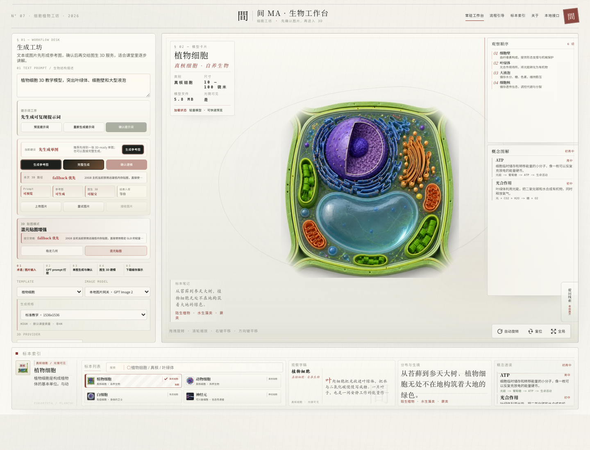

# 3D Agent

AI-assisted biology 3D generation workbench for classroom-grade model exploration, reference-image creation, image-to-3D reconstruction, and guarded texture post-processing.



3D Agent turns biology concepts or uploaded reference images into inspectable 3D teaching assets. The product is designed around one practical constraint: self-hosted image-to-3D and texture jobs can be memory-heavy, so the workflow must be observable, resumable, and conservative enough to run on constrained 20GB-class machines.

## What It Does

| Area | Capability |
| --- | --- |
| 3D learning stage | Browse curated biology GLB specimens with a classroom-oriented Three.js viewer. |
| Generation workbench | Convert a biology term or uploaded image into a 3D-ready reference image. |
| Image-to-3D pipeline | Submit confirmed references to a self-hosted ComfyUI / TripoSG / Bio3D workflow. |
| Texture path | Attempt guarded Hunyuan3D-Paint post-processing, then fall back to lightweight colored GLB output when memory is unsafe. |
| Stability controls | Serialize heavy jobs, inspect RAM/VRAM headroom, preserve recoverable task state, and avoid repeated OOM-triggering retries. |
| Local gateway | Integrate a local image gateway without committing API keys or generated runtime artifacts. |

## Product Flow

```text
biology prompt or uploaded image
  -> 3D-ready prompt polishing
  -> local image gateway reference image
  -> user confirmation
  -> TripoSG geometry reconstruction
  -> Bio3D final GLB post-processing
  -> optional Hunyuan3D-Paint texture enhancement
  -> protected color fallback when texture memory is unsafe
  -> cached model in the 3D stage
```

The preferred production posture is simple: keep geometry stable first, run texture enhancement only when resource checks pass, and always preserve a usable non-white GLB instead of letting the workflow collapse back to a white model.

## Tech Stack

- Vite, React 19, TypeScript
- Three.js, `@react-three/fiber`, `@react-three/drei`
- Node.js API server for generation jobs, provider status, references, and model cache
- Local image gateway for text-to-image reference generation
- ComfyUI workflows for TripoSG geometry, optional Hunyuan3D-Paint texture, and Bio3D post-processing
- Node test runner for API/workflow utility coverage

## Repository Layout

```text
.
├── README.md
├── LICENSE
├── TIMELINE.md
├── app/                         # Vite React frontend
│   ├── public/
│   │   ├── draco/               # Local Draco decoder
│   │   ├── images/              # Curated specimen images
│   │   └── models/              # Curated GLB specimens
│   └── src/
├── docs/
│   ├── GITHUB_RELEASE.md
│   ├── LOCAL_3D_OPENAI_DEPLOYMENT.md
│   ├── MA_CELL_STUDIO_PROMPT.md
│   └── assets/screenshots/
├── scripts/                     # Smoke and texture validation scripts
├── server/                      # Provider, workflow, store, and GLB utilities
├── test/                        # API and app utility tests
└── server.mjs
```

## Quick Start

```bash
npm --prefix app install
cp .env.example .env.local
npm run dev:api
npm run dev:app
```

Default local services:

| Service | URL |
| --- | --- |
| Frontend | `http://127.0.0.1:5173` |
| API | `http://127.0.0.1:8791` |
| Local image gateway | `http://127.0.0.1:48760` |

If a port is busy:

```bash
API_PORT=8792 npm run dev:api
VITE_API_BASE=http://127.0.0.1:8792 npm --prefix app run dev -- --host 127.0.0.1 --port 5174
```

Keep secrets in `.env.local`; do not commit real API keys.

## Configuration

Key environment variables:

| Setting | Purpose |
| --- | --- |
| `LOCAL_IMAGE_GATEWAY_BASE_URL` | Local text-to-image gateway, usually `http://127.0.0.1:48760`. |
| `LOCAL_IMAGE_GATEWAY_API_KEY` | Local gateway key, stored only in `.env.local`. |
| `COMFYUI_BASE_URL` | Self-hosted 3D service endpoint. |
| `COMFYUI_RESOURCE_GUARD` | Enables queue, RAM, and VRAM guardrails. |
| `COMFYUI_LOCAL_QUEUE_MAX_PENDING` | Keeps heavy jobs serialized. |
| `COMFYUI_HY3DPAINT_*` | Hunyuan3D-Paint texture and low-memory fallback settings. |

Detailed deployment and 20GB-server tuning notes:

```text
docs/LOCAL_3D_OPENAI_DEPLOYMENT.md
```

## Verification

Fast checks:

```bash
npm run test:api
npm run build
```

Workflow checks:

```bash
npm run smoke:workflow
npm run smoke:texture-artifacts
```

Live generation checks should only run when the local image gateway and 3D server are intentionally available:

```bash
SMOKE_LIVE_IMAGE_GATEWAY=1 SMOKE_LIVE_3D=1 SMOKE_FULL_WORKFLOW=1 \
  SMOKE_IMAGE_PROVIDER=local-gateway \
  npm run smoke:workflow -- 植物细胞开放剖面 3D 教学模型
```

Texture stability validation:

```bash
npm run smoke:texture-stability -- --runs=3 --timeout-minutes=80
```

## Runtime Artifacts

The app creates local runtime state while generating references and models. These paths are intentionally ignored:

```text
.env.local
.generated-models/
.reference-cache/
.reference-work/
.reference-trash/
.workflow-store/
.run-logs/
.qa-screenshots-*/
artifacts/
app/dist/
app/node_modules/
```

Before publishing, run:

```bash
git status --short --branch
git status --ignored --short
git diff --check
```

## GitHub Publishing

Recommended GitHub metadata:

| Field | Value |
| --- | --- |
| Repository name | `3d-agent` |
| Description | `AI-assisted biology 3D generation workbench with image-to-3D reconstruction and guarded texture post-processing.` |
| Topics | `3d`, `biology`, `react`, `threejs`, `image-to-3d`, `comfyui`, `hunyuan3d`, `education` |

Release notes and history policy:

- [TIMELINE.md](TIMELINE.md) records the local commit density and milestone split.
- [docs/GITHUB_RELEASE.md](docs/GITHUB_RELEASE.md) records the publication checklist.
- Do not fabricate old GitHub push events. Use the timeline for the development narrative and keep daily milestone commits going forward.

## License

MIT. See [LICENSE](LICENSE).
