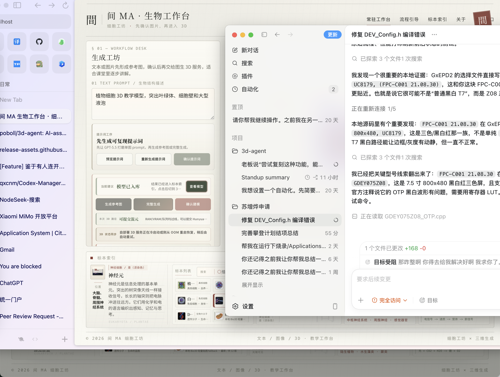

# 3D Agent

AI-assisted biology 3D generation workbench for classroom-grade model exploration, reference-image generation, image-to-3D reconstruction, and guarded texture post-processing.

3D Agent turns a biology prompt or uploaded reference image into an inspectable teaching model. It is built for a practical production constraint: self-hosted 3D and texture pipelines can be slow and memory-heavy, so every heavy step is observable, resumable, serialized, and protected by RAM/VRAM guardrails.

> 中文简介：3D Agent 是一个面向生物教学场景的 3D 生成工作台。它把“生物结构描述 / 上传图片”整理为稳定参考图，再接入本地图像网关、自部署 TripoSG / Bio3D / Hunyuan3D-Paint 工作流，最终在浏览器中的 3D 舞台展示可讲解、可复盘、可缓存的 GLB 模型。

## Screenshots / 界面预览

| Local API / 本地接口 | Workbench / 常驻工作台 |
| --- | --- |
|  |  |

| Flow Guide / 流程引导 | Specimen Index / 标本索引 |
| --- | --- |
|  |  |

All screenshots above are foreground Chrome captures from the running local app at `http://127.0.0.1:5173`, kept at `2456x1856` Retina resolution for GitHub display.

## Why It Exists

Most image-to-3D demos look good only when the generation path succeeds once. 3D Agent is designed around repeatable classroom use:

- Prompt to reference image: produce a single 3D-ready biology reference image through the local image gateway.
- Reference image to geometry: submit the confirmed image to self-hosted TripoSG and Bio3D.
- White model to colored model: prefer Hunyuan3D-Paint when resources are safe; otherwise keep a non-white lightweight color/texture fallback.
- Long-running jobs: preserve task state, prompt IDs, cached references, raw GLB, final GLB, and resumable diagnostics.
- Low-memory machines: serialize heavy tasks and avoid repeated OOM-triggering retries on 20GB-class hosts.

中文说明：

- 先确认参考图，再进入图生 3D，避免直接把不稳定图片提交到长任务。
- 优先保证 raw / final GLB 可用，再判断是否执行混元贴图增强。
- 20GB 机器上不强行压满内存；资源不足时走轻量彩色 fallback，避免最终只剩白模。
- 所有生成任务都保留缓存、状态、诊断与可恢复入口，方便长时间运行后继续排查。

## Product Capabilities

| Area | English | 中文 |
| --- | --- | --- |
| 3D stage | Classroom-oriented Three.js viewer with curated biology GLB specimens. | 面向课堂讲解的 3D 舞台，支持标本观察、旋转、复位和索引切换。 |
| Generation workbench | Prompt polishing, image upload, reference acceptance, and model creation in one workflow. | 生成工坊把提示词、上传图、参考图验收和建模提交放在同一条链路里。 |
| Local image gateway | Uses a local OpenAI-compatible image gateway, with configurable prompt/image models. | 接入本地图片网关，可配置 `gpt-5.5` prompt 打磨与 `gpt-image-2` 生图路线。 |
| Image-to-3D | Self-hosted ComfyUI workflow for TripoSG geometry and Bio3D post-processing. | 接入自部署 ComfyUI，将确认图片转为 TripoSG raw GLB，再经过 Bio3D 处理。 |
| Texture strategy | Guarded Hunyuan3D-Paint, plus lightweight reference-colored fallback when memory is unsafe. | 在资源安全时尝试混元贴图；资源不足时写入轻量彩色贴图兜底。 |
| Stability controls | Queue guard, RAM/VRAM preflight, runtime guard, cache retention, and compact job history. | 单队列、内存/显存预检、运行时保护、任务缓存和紧凑历史记录。 |

## Architecture

```text
biology prompt or uploaded image
  -> GPT-5.5 3D-ready prompt polishing
  -> local image gateway reference image
  -> user accepts or retries the image
  -> self-hosted TripoSG raw geometry
  -> Bio3D final GLB post-processing
  -> optional Hunyuan3D-Paint texture enhancement
  -> protected lightweight color/texture fallback when memory is unsafe
  -> cached GLB shown in the 3D stage and specimen index
```

```text
app/                 Vite + React + Three.js frontend
server/              Node API, provider adapters, job store, GLB utilities
server/workflows/    ComfyUI workflow templates
scripts/             Smoke tests and texture stability checks
test/                Node test runner suites
docs/                Deployment notes, release notes, screenshots
```

## Tech Stack

- Frontend: Vite, React 19, TypeScript, Three.js, `@react-three/fiber`, `@react-three/drei`
- Backend: Node.js ESM API server, local JSON job/reference/model stores
- Generation: local image gateway, OpenAI-compatible prompt/image route, ComfyUI, TripoSG, Bio3D, optional Hunyuan3D-Paint
- Quality: ESLint, TypeScript build, Node test runner, smoke scripts for workflow and texture artifacts

## Quick Start / 快速启动

Requirements:

- Node.js 20+ recommended.
- A local or remote ComfyUI-compatible 3D service for live image-to-3D.
- A local image gateway if you want live text-to-image generation.

Install dependencies:

```bash
npm --prefix app install
cp .env.example .env.local
```

Start the API and frontend in two terminals:

```bash
npm run dev:api
```

```bash
VITE_API_BASE=http://127.0.0.1:8791 npm --prefix app run dev -- --host 127.0.0.1 --port 5173
```

Default local services:

| Service | URL |
| --- | --- |
| Frontend | `http://127.0.0.1:5173` |
| API | `http://127.0.0.1:8791` |
| Local image gateway | `http://127.0.0.1:48760` |
| Self-hosted 3D service | `http://47.242.195.8:8010` by default in `.env.example` |

If a port is busy:

```bash
API_PORT=8792 npm run dev:api
VITE_API_BASE=http://127.0.0.1:8792 npm --prefix app run dev -- --host 127.0.0.1 --port 5174
```

中文启动说明：

1. 复制 `.env.example` 到 `.env.local`。
2. 把真实 API key 只写入 `.env.local`，不要提交。
3. 先启动 `npm run dev:api`，再启动前端。
4. 打开 `http://127.0.0.1:5173`，从“生成工坊”或“本地接口”页检查链路。

## Configuration / 配置

Important environment variables:

| Variable | Purpose |
| --- | --- |
| `API_HOST`, `API_PORT` | Local API bind host and port. |
| `VITE_API_BASE` | Frontend API base URL, passed when starting Vite. |
| `LOCAL_IMAGE_GATEWAY_BASE_URL` | Local image gateway, usually `http://127.0.0.1:48760`. |
| `LOCAL_IMAGE_GATEWAY_API_KEY` | Local image gateway key. Keep it in `.env.local` only. |
| `LOCAL_IMAGE_GATEWAY_PROMPT_MODEL` | Prompt polishing model, default `gpt-5.5`. |
| `LOCAL_IMAGE_GATEWAY_IMAGE_MODEL` | Image generation model, default `gpt-image-2`. |
| `COMFYUI_BASE_URL` | Self-hosted ComfyUI / 3D service endpoint. |
| `COMFYUI_RESOURCE_GUARD` | Enables RAM, VRAM, queue, and runtime guardrails. |
| `COMFYUI_LOCAL_QUEUE_MAX_PENDING` | Serializes heavy local jobs. Recommended: `1`. |
| `COMFYUI_HY3DPAINT_ENABLED` | Enables optional Hunyuan3D-Paint texture path. |
| `COMFYUI_HY3DPAINT_MIN_RAM_FREE_GB` | Minimum free system RAM before texture submission. |
| `COMFYUI_HY3DPAINT_RUNTIME_MIN_RAM_FREE_GB` | Runtime abort/fallback threshold for texture jobs. |
| `COMFYUI_HY3DPAINT_AUTO_FALLBACK` | Writes a lightweight non-white fallback when texture is unsafe. |

For deployment and 20GB-server tuning, see [docs/LOCAL_3D_OPENAI_DEPLOYMENT.md](docs/LOCAL_3D_OPENAI_DEPLOYMENT.md).

## Image-to-3D and Texture Stability

The safest production route is geometry first, texture second:

1. Generate or upload one reference image.
2. Accept the image after visual review.
3. Submit image-to-3D using self-hosted TripoSG + Bio3D.
4. Cache raw and final GLB outputs.
5. Try Hunyuan3D-Paint only when RAM/VRAM checks pass.
6. If Hunyuan is unsafe, timed out, or unobservable, generate a lightweight reference-colored fallback instead of returning a white model.

Low-memory guidance:

- 20GB total system RAM can run the guarded workflow, but native Hunyuan texture is not guaranteed.
- The repo defaults to strict queueing and runtime guardrails so a failed texture attempt does not repeatedly OOM the host.
- The lightweight fallback path is intentionally part of the product, not a hidden failure state: it keeps the model colored and usable for classroom display.

中文稳定性说明：

- “白模可用”不是最终目标；系统会优先尝试混元贴图，资源不足时改用参考图轻量贴图。
- 20GB 内存不适合无保护地连续跑 Hunyuan3D-Paint，所以默认启用单队列和内存闸门。
- 如果远端 ComfyUI 冷启动、队列繁忙或 history 不完整，任务会进入可恢复状态，而不是盲目重试。

## Verification / 验证

Fast local checks:

```bash
npm --prefix app run lint
npm run build
npm run test:api
```

Workflow smoke checks:

```bash
npm run smoke:workflow
npm run smoke:ui
npm run smoke:texture-artifacts
```

Live full-chain check, only when the local image gateway and 3D server are intentionally available:

```bash
SMOKE_LIVE_IMAGE_GATEWAY=1 SMOKE_LIVE_3D=1 SMOKE_FULL_WORKFLOW=1 \
  SMOKE_IMAGE_PROVIDER=local-gateway \
  npm run smoke:workflow -- 植物细胞开放剖面 3D 教学模型
```

Texture stability validation:

```bash
npm run smoke:texture-stability -- --runs=3 --timeout-minutes=80
```

For low-memory machines, start with a dry run or fallback-only validation before forcing native Hunyuan texture:

```bash
TEXTURE_STABILITY_TEXTURE_MODE=fallback-color npm run smoke:texture-stability -- --runs=3
```

## Repository Hygiene / 仓库整理规则

Runtime and generated artifacts are intentionally ignored:

```text
.env.local
.generated-models/
.reference-cache/
.reference-work/
.reference-trash/
.workflow-store/
.run-logs/
.qa-screenshots-*/
artifacts/
app/dist/
app/node_modules/
release/
*.bundle
```

Before publishing:

```bash
git status --short --branch
git status --ignored --short
git diff --check
npm --prefix app run lint
npm run build
npm run test:api
```

Do not commit real API keys, generated PNG drafts, local conversation archives, runtime caches, or temporary QA screenshots. Keep only curated screenshots under `docs/assets/screenshots/`.

## GitHub Metadata

Recommended repository settings:

| Field | Value |
| --- | --- |
| Repository name | `3d-agent` |
| Description | `AI-assisted biology 3D generation workbench with image-to-3D reconstruction and guarded texture post-processing.` |
| Topics | `3d`, `biology`, `react`, `threejs`, `image-to-3d`, `comfyui`, `hunyuan3d`, `education` |
| License | MIT |

History policy:

- [TIMELINE.md](TIMELINE.md) documents the real local development timeline.
- [docs/GITHUB_RELEASE.md](docs/GITHUB_RELEASE.md) records the release checklist.
- Do not rewrite dates or fabricate old GitHub push events. Use milestone commits going forward.
- Preferred commit style: `fix: 中文描述`, `feat: 中文描述`, `docs: 中文描述`.

## API Surface

| Endpoint | Purpose |
| --- | --- |
| `GET /api/health` | API health check. |
| `GET /api/providers/status` | Local image gateway, 3D service, queue, RAM, and VRAM status. |
| `POST /api/references/prompt-preview` | Build a 3D-ready prompt without generating an image. |
| `POST /api/references/text-to-image` | Generate a reference image through the configured image provider. |
| `POST /api/references/upload` | Upload a PNG, JPEG, or WebP reference image. |
| `POST /api/workflows/full-text-to-3d` | Run prompt -> image -> image-to-3D as one workflow. |
| `POST /api/workflows/text-to-cell` | Submit an accepted reference image to the 3D workflow. |
| `POST /api/jobs/:jobId/texture-enhance` | Reuse a completed raw GLB and reference image for texture enhancement. |
| `GET /api/jobs/:jobId` | Poll workflow progress and outputs. |
| `GET /api/jobs` | Read recent compact job history. |
| `GET /api/3d/demo-models` | Read cached local GLB/GLTF models. |

## License

MIT. See [LICENSE](LICENSE).
